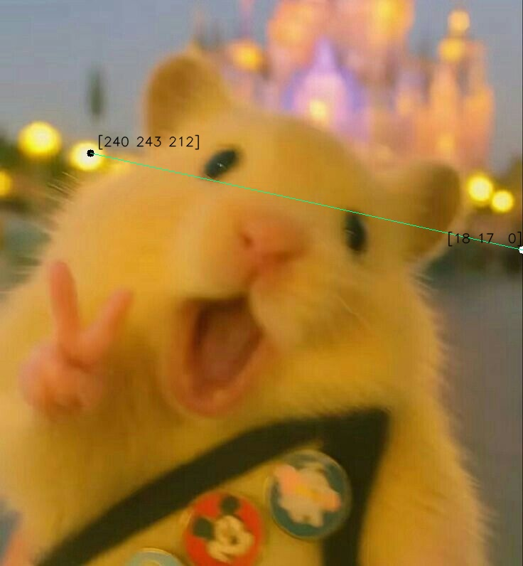

<h1 align="center">Práctica 1</h1>

<h2 align="center">Asignatura: Visión por Computador</h2>

Universidad de Las Palmas de Gran Canaria  
Escuela de Ingeniería en Informática  
Grado de Ingeniería Informática  
Curso 2025/2026 

<h2 align="center">Autores</h2>

- Asmae Ez Zaim Driouch
- Javier Castilla Moreno

<h2 align="center">Bibliotecas utilizadas</h2>

[](https://numpy.org/)
[](https://opencv.org/)
[](https://matplotlib.org/)

## Cómo usar
### Primer paso: clonar este repositorio
```bash
git clone "https://github.com/Javier-Castilla/VC-P1"
```
### Segundo paso: Activar tu envinroment e instalar dependencias
> [!NOTE]
> Todas las dependencias pueden verse en [este archivo](envinronment.yml). Si se desea, puede crearse un entorno de Conda con dicho archivo.

Si se opta por crear un nuevo `Conda envinronment` a partir del archivo expuesto, es necesario abrir el `Anaconda Prompt` y ejecutar lo siguiente:

```bash
conda env create -f environment.yml
```

Posteriormente, se activa el entorno:

```bash
conda activate VC_P1
```

### Tercer paso: ejecutar el cuaderno
Finalmente, abriendo nuestro IDE favorito y teniendo instalado todo lo necesario para poder ejecutar notebooks, se puede ejecutar el cuaderno de la práctica [Práctica1.ipynb](Práctica1.ipynb) seleccionando el envinronment anteriormente creado.

> [!IMPORTANT]
> Todos los bloques de código deben ejecutarse en órden, de lo contrario, podría ocasionar problemas durante la ejecución del cuaderno.

<h1 align="center">Tareas</h2>


<h2 align="center">Tarea 1: Tablero de ajedrez</h2>

Se genera tableros de ajedrez utilizando OpenCV y NumPy. El código crea diferentes variaciones de tableros con patrones alternados de colores y diferentes dimensiones. El código produce tres versiones:

- Versión clásica: Blanco y negro tradicional
- Versión colorida: Rosa y verde pastel
- Versión dimensiones aumentada: En este caso 16x16

El recorrido se realiza mediante dos bucles anidados que iteran por filas y columnas. El incremento se hace por el tamaño del cuadrado para posicionarse en cada casilla:

```python
    for row in range(0, height, height//dimension):
    current_offset = int(offset) * square_size

    for column in range(0, width, width//dimension):
        
        if(((row // square_size) + (column // square_size)) & 1 == 0):
            square_color=color1
        else:
            square_color=color2

        cv2.rectangle(color_img, 
                      (row+current_offset,column),
                      (row+current_offset+square_size,column+square_size), 
                      square_color, 
                      -1)
        offset = not offset
```

El patrón de ajedrez se logra usando una operación bitwise que determina si la suma de coordenadas es par o impar:

```python
    if(((row // square_size) + (column // square_size)) & 1 == 0):
            square_color=color1
        else:
            square_color=color2

```

El operador & 1 obtiene el bit menos significativo
Si es 0 → número par → primer color
Si es 1 → número impar → segundo color

Se define el tamaño de cada cuadrado dividiendo las dimensiones totales entre el número de casillas por lado:
```python
    square_size = (width//dimension)
```

El offset corrige la alineación del patrón alternado:

- Se alterna entre True y False en cada fila
- Desplaza horizontalmente cada fila par para mantener el patrón de ajedrez
- Evita que las filas se desalineen creando columnas verticales del mismo color

```python
    current_offset = int(offset) * square_size
    offset = not offset
```

<table align="center">
   <td width="33.33%">
      <h3 align="center">Tablero de ajedrez 8x8</h3>
      <div align="center">
      
   </td>
   <td width="33.33%">
      <h3 align="center">Tablero de ajedrez colorido 8x8</h3>
      <div align="center">                                       
      </a>
   <br> 
   <td width="50%">
      <h3 align="center">Tablero de ajedrez colorido 16x16</h3>
      <div align="center">                                       
      </a>
   <br>                                                 
</table>

<h2 align="center">Tarea 2: Imagen al estilo Mondrian</h2>

Se ha generado una imagen al estilo `Mondrian` haciendo uso de las utilidades que presenta la biblioteca `OpenCV`.

Concretamente, se ha tomado como referencia la siguiente imagen:


La manera de proceder ha sido sencilla, se han guardado en una lista de python las distintas coordenadas necesarias para dibujar los distintos rectángulos que conforman la imagen. Junto a las coordenadas, se establece el color que tendrá cada rectángulo.

Una vez guardadas las diferentes coordenadas y colores, se recorre la lista y se dibuja sobre una imagen generada inicialmente en blanco cada rectángulo de la siguiente manera:

```python
for i, rectangle in enumerate(rectangles):
    cv2.rectangle(img, rectangle[0], rectangle[1], rectangle[2], -1)
    cv2.rectangle(img, rectangle[0], rectangle[1], (0, 0, 0), 5)
```

> [!NOTE]
> La función `cv2.rectangle` es la encargada de dicujar cada rectángulo pasándole la imagen, las coordenadas de las esquinas superior izquierda e inferior derecha, su color y su ancho, siendo `-1` el valor para rellenar el rectángulo

Posteriormente, se muestra la imagen y se guarda en disco de la siguiente manera:

```python
plt.imshow(img)
plt.show()
cv2.imwrite('imgs/mondrian.jpg', cv2.cvtColor(img, cv2.COLOR_RGB2BGR))
```

> [!NOTE]
> Destacar que es necesario pasar la imagen a BGR antes de guardarla en disco haciendo uso de OpenCV para una correcta visualización posterior. Esto seguirá presente a lo largo de la práctica.

La imagen resultante es la siguiente:


<h2 align="center">Tarea 3: editar los diferentes planos de una imagen</h2>

Para esta tarea, se han editado los diferentes planos tanto de una imagen guardada en disco como los fotogramas de un vídeo en vivo tomados desde la webcam del ordenador.
Con el fin de que dichas modificaciones sean reutilizables y aplicables a diferentes imágenes o fotogramas, se ha realizado una clase para esta tarea, permitiendo aplicar filtros y máscaras de una manera sencilla y cómoda (`Tarea3`).

En dicha existen métodos estáticos que permiten invertir los diferentes colores de una imagen (R, G, B) así como el negativo de la misma o en su defecto, modificar individualmente y de manera personalizada los diferentes canales. En resumen, permite las siguientes operaciones:
- Imagen en negativo
- Invertir un canal específico
- Modificar canales de manera personalizada


<h3 align="center">Modificación de los diferentes canales de una imagen leída de disco</h3>

Para lograr esto, se ha seleccionado una imagen y se ha cargado en memoria desde el disco con el siguiente código:

```python
image = cv2.imread('imgs/happy_hamster.jpg', cv2.IMREAD_COLOR_RGB)
plt.imshow(image)
plt.show()
```

Mostrándose la siguiente imagen:


> [!NOTE]
> La función `cv2.imread` es la encargada de leer la imagen de disco pasadas una ruta y la forma de lectura, que en este caso ha sido lectura en `RGB`, pues originalmente `OpenCV` lee las imágenes en `BGR`.

A continuación, se han invertido los colores de la imagen haciendo uso de la clase `Tarea3` nombrada anteriormente.

Se presenta el código de dicho método:

```python
@staticmethod
def negative_image(image):
    return 255 - image
```

Simplemente, se resta al `valor máximo (255)` el valor de cada píxel de la imagen, obteniendo así su complementario. El resultado se muestra con el siguiente código:

```python
plt.imshow(img := Tarea3.apply(image, Tarea3.NEGATIVE))
plt.show()
cv2.imwrite("imgs/happy_hamster_negative.jpg", cv2.cvtColor(img, cv2.COLOR_RGB2BGR))
```

Y ésta es la imagen resultante:


Aplicando ésta misma estrategia, se ha invertido el canal `verde (G)` de la imagen original, resultando en el siguiente código:

```python
plt.imshow(img := Tarea3.apply(image, Tarea3.INVERT_GREEN))
plt.show()
cv2.imwrite("imgs/happy_hamster_green_negative.jpg", cv2.cvtColor(img, cv2.COLOR_RGB2BGR))
```

Resultando en la siguiente imagen:


El método utilizado para ello ha sido el siguiente:

```python
@staticmethod
def invert_green(image):
    image = image.copy()
    image[:,:,1] = 255 - image[:,:,1]
    return image
```

En él, se observa como se aplica la misma estrategia inicial, pues se le resta al `mñaximo valor (255)` el valor de cada píxel en el `canal verde (G)`.

> [!NOTE]
> Para invertir el resto de colores se aplica la misma estrategia en el `canal deseado`.

Finalmente, se ha editado de manera aleatoria la imagen original, `invirtiendo el canal rojo (R)`, estableciendo al `12% de su valor original el canal verde (G)` y `omitiendo completamente el canal azul (B)`. Para ello se ha hecho uso del siguiente código:

```python
plt.imshow(img := Tarea3.change_color_percentage(image, -1, 0.12, 0))
plt.show()
cv2.imwrite("imgs/happy_hamster_random.jpg", cv2.cvtColor(img, cv2.COLOR_RGB2BGR))
```

Resultando en la siguiente imagen:


Para lograr esto, se ha hecho uso del siguiente método:

```python
@staticmethod
def change_color_percentage(image, r=1, g=1, b=1):
    image = image.copy()
    image[:,:,0] = (image[:,:,0] * r) if r != -1 else 255 - image[:,:,0]
    image[:,:,1] = (image[:,:,1] * g) if g != -1 else 255 - image[:,:,1]
    image[:,:,2] = (image[:,:,2] * b)if b != -1 else 255 - image[:,:,2]
    return image
```

Como se puede observar, se pasan por parámetros tanto la `imagen` como el `porcentaje del valor` que tendrá cada canal en la nueva imagen, `siendo -1 la inversión de dicho canal`.

<h3 align="center">Modificación de los diferentes canales de los fotogramas de un vídeo en vivo tomado desde la webcam</h3>

Para lograr obtener un vídeo en vivo a través de la webcam, al igual que para leer una imagen de disco, se ha usado la biblioteca `OpenCV`, concretamente el siguiente método:

```python
video = cv2.VideoCapture(0)
```

Ésto, con la ayuda de un bucle infinito, permite leer los diferentes fotogramas del vídeo en tiempo real tomado por la webcam de la siguiente manera:

```python
while True:
    ret, frame = video.read()
```

> [!NOTE]
> En la variable `ret`se indica si se ha leído un fotograma, mientras que en `frame` se guarda el fotograma en caso de ser leído correctamente.

En este caso, se han añadido controles para cambiar entre la inversión total de canales de los fotogramas o en consecuencia, la inversión de un canal concreto. Los controles son los siguientes:
- `1` -> Negativo
- `2` -> Verde invertido
- `3` -> Azul invertido
- `4` -> Rojo invertido

Al elegir la máscara que queramos aplicar a la imagen, se mostrará en tiempo real, permitiéndo ver el vídeo tomado por la webcam de maneras singulares.

A continuación, se muestra una tabla con las cuatro modificaciones posibles:

<table align"center>
    <td width="25%">
        
    </td>
    <td width="25%">
        
    </td>
    <td width="25%">
        
    </td>
    <td width="25%">
        
    </td>
</table>

Para la definición de los controles, se ha usado el siguiente fragmento de código:

```python
pressed_key = cv2.waitKey(20) & 0xFF

if pressed_key == 27:
    break
elif pressed_key in methods_map:
    current_method = methods_map[pressed_key]
```

En el código anterior, 27 es el valor `ASCII` asignado a la tecla `ESC`. Si se ha detectado esta tecla, se termina la ejecución. Encambio, si se ha detectado cualquier tecla del `1 al 4`, se aplica al fotograma la modificación de canales correspondiente.

> [!NOTE]
> Para la modificación de los diferentes canales de cada fotograma, se ha seguido el mismo procedimiento que con la imagen leída de disco, es decir, se ha hecho uso de las utilidades desarrolladas en la clase `Tarea3`.

<h2 align="center">Tarea 4a: Enconcontrar píxel más claro y oscuro de la imagen</h2>

Para esta tarea se desarrolla dos versiones de un sistema de detección en tiempo real que identifica automáticamente los píxeles más claros y oscuros de una imagen capturada desde la webcam utilizando OpenCV. El programa marca visualmente estos píxeles y muestra sus valores de intensidad.Las versiones desarrolladas son:

- Usando cv2.minMaxLoc()
- Usando las herramientas de numpy

<h3 align="center">Tarea 4a: Usando cv2.minMaxLoc()</h3>

Se utiliza la función nativa de OpenCV para encontrar eficientemente los valores mínimos y máximos en una imagen en escala de grises:

```python
    def find_max_and_min_pixel(frame):
    gray_vid = cv2.cvtColor(frame, cv2.COLOR_BGR2GRAY)
    return cv2.minMaxLoc(gray_vid)
```

Convierte la imagen a escala de grises para análisis de intensidad y retorna una tupla:
- `min_val`: Valor del píxel más oscuro (0-255)
- `max_val`: Valor del píxel más claro (0-255)  
- `min_loc`: Coordenadas (x,y) del píxel más oscuro
- `max_loc`: Coordenadas (x,y) del píxel más claro

📚 **Documentación oficial:** [cv2.minMaxLoc() - OpenCV Documentation](https://docs.opencv.org/4.x/d2/de8/group__core__array.html#ga7622c466c628a75d9ed008b42250a73f)


Bucle Principal de procesamiento:

```python
    while(True):
    ret, frame = vid.read()

    if ret:

        if (mouse_event_flag==0):
            cv2.imshow("Camara", frame)
            cv2.setMouseCallback("Camara", mouse_events)
            mouse_event_flag=1

        min_px, max_px, min_px_coordinates, max_px_coordinates = find_max_and_min_pixel(frame)

        cv2.circle(frame, min_px_coordinates, 10, min_color, 2)
        cv2.circle(frame, max_px_coordinates, 10, max_color, 2)

        # Se usa la función creada para que el texto no salga de la imagen
        put_text_inside(frame, f"Darker: {min_px}", min_px_coordinates, 
                        font=cv2.FONT_HERSHEY_TRIPLEX, scale=0.5, color=min_color, thickness=1)

        put_text_inside(frame, f"Lighter: {max_px}", max_px_coordinates, 
                        font=cv2.FONT_HERSHEY_TRIPLEX, scale=0.5, color=max_color, thickness=1)
        
        cv2.imshow('Camara', frame)
```

Procesa contínuamente los frames del vídeo y al obtener los valores de intensidad los marca con círculo de colores y un texto con su información numérica que siempre permanece visible:
- **Púrpura** `(100,0,100)` → Píxel más oscuro
- **Rosa** `(50,0,200)` → Píxel más claro

**Salida del Programa**:
Pulsando en **ESC** se termina la ejecución y cierra la aplicación


<h3 align="center">Tarea 4a: Usando las herramientas de numpy</h3>

Otra manera de realizar esta tarea es utilizando los métodos que nos brinda `numpy`, pues ésta biblioteca almacena los valores de la imagen de forma lineal, y dado que está desarrollada en `C`, los métodos que tiene para buscar valores máximos y mínimos son realmente eficientes y rápidos. Concretamente, se han desarrollado estas funciones para encontrar el píxel más oscuro y más claro respectivamente con ayuda de `numpy`:

```python
def darkest_pixel_index(image):
    y, x, *_ = np.unravel_index(np.argmin(image), image.shape)
    return (x, y)
```

```python
def lightest_pixel_index(image):
    y, x, *_ = np.unravel_index(np.argmax(image), image.shape)
    return (x, y)
```

> [!NOTE]
> Los métodos `np.argmin` y `np.argmax` devuelven el índice lineal con el `valor mínimo (píxel más oscuro)` y `maximo (píxel más claro)` respectivamente. Sin embargo, es necesario obtener las coordenadas de dichos píxeles, por lo que `numpy` cuanta con el método `np.unravel_index`. que nos harán la traspolación.

A continuación, se ha cargado la misma imagen de la `Tarea 3` para detectar en ella el píxel más claro y más oscuro:

```python
image = cv2.imread("imgs/happy_hamster.jpg", cv2.IMREAD_COLOR_RGB)
gray = cv2.cvtColor(image, cv2.COLOR_RGB2GRAY)
```

> [!NOTE]
> Nótese el cambio de la imagen a escala de grises para facilitar la detección de dichos píxeles.

Una vez cargada la imagen, se consiguen las coordenadas de ambos píxeles comn las funciones mostradas anteriormente y se dibujan en la misma dichos píxeles unidos por una línea, así como se indica el valor `RGB` de dichos píxeles:

```python
min_index = darkest_pixel_index(gray)
max_index = lightest_pixel_index(gray)

val_max = image[max_index[1], max_index[0]].copy()
val_min = image[min_index[1], min_index[0]].copy()

cv2.circle(image, min_index, 5, (255, 255, 255), -1)
cv2.circle(image, max_index, 5, (0, 0, 0), -1)
cv2.line(image, min_index, max_index, (0, 255, 150))

put_text_inside(image, str(val_max), max_index)
put_text_inside(image, str(val_min), min_index)
```

Resultando en la siguiente imagen:



> [!NOTE]
> Si se quisiera usar para detectar dichos píxeles entiempo real en un vídeo tomado con la webcam, bastaría con usar las funciones presentadas anteriormente en cada fotograma.

Para ambas versiones se ha detectado que usando el cv2.putText(), cuando el pixel más oscuro o más claro se encuentra en los bordes de la imagen, el texto se muestra fuera de la misma. Por ello se ha utilizado herramientas de IA para generar una función que evite que las etiquetas de texto se salgan de los límites de la imagen ajustando automáticamente su posición:

```python
    def put_text_inside(
    img,
    text,
    pos,
    font=cv2.FONT_HERSHEY_SIMPLEX,
    scale=0.6,
    color=(0,0,0),
    thickness=1,
    offset=(10, -10)
):
    """
    Dibuja un texto dentro de los límites de la imagen, con un pequeño offset respecto a la posición dada.
    Parámetros:
        img   : imagen destino
        text  : string a dibujar
        pos   : (x, y) coordenadas del punto de referencia
        offset: (dx, dy) desplazamiento respecto a pos
    """
    h, w = img.shape[:2]
    (text_w, text_h), _ = cv2.getTextSize(text, font, scale, thickness)

    # Aplicar offset
    x = pos[0] + offset[0]
    y = pos[1] + offset[1]

    # Ajustar coordenadas si el texto se sale
    if x < 0:
        x = 0
    if x + text_w > w:
        x = w - text_w
    if y - text_h < 0:
        y = text_h
    if y > h - 1:
        y = h - 1

    cv2.putText(img, text, (x, y), font, scale, color, thickness, cv2.LINE_AA)
```

<h2 align="center">Tarea 4b: Enconcontrar la zona 8x8 más clara/oscuran</h2>

Para esta tarea se desarrolla tres versiones de un sistema de detección en tiempo real que identifica regiones completas según las dimensiones propuestas (en un inicio 8x8) más claros y oscuros de una imagen capturada desde la webcam utilizando OpenCV.Las versiones desarrolladas son:

- Usando cv2.resize()
- Usando máscaras
- Usando Fuerza bruta

Nuevamente, en las tres versiones se hace usao de la función anterior en donde evita que las etiquetas de texto se salgan de los límites de la imagen ajustando automáticamente su posición: **put_text_inside(img, text, pos, font=cv2.FONT_HERSHEY_SIMPLEX, scale=0.6, color=(0,0,0), thickness=1, offset=(10, -10))**

<h3 align="center">Tarea 4b:  Usando cv2.resize()</h3>

El algoritmo divide la imagen en una grilla de bloques de 8x8 píxeles y encuentra las regiones con mayor y menor intensidad promedio. 

Esto se logra debido a que la función resize de openCV divide mentalmente la imagen en una cuadrícula de bloques 8x8 y calcula el promedio de intensidad de cada bloque usando interpolación bilineal.


📚 **Documentación técnica:** [Resizing and Rescaling Images with OpenCV](https://opencv.org/blog/resizing-and-rescaling-images-with-opencv/)

Logrando con ello reducir el costo computacional.

```python
    def find_max_and_min_pixel_8x8(frame):
    gray_vid = cv2.cvtColor(frame, cv2.COLOR_BGR2GRAY)
    height, width = gray_vid.shape
    vid_block = cv2.resize(gray_vid, (width//block_size, height//block_size))
    return cv2.minMaxLoc(vid_block)
```

Una imagen de 640x480 se convierte en 80x60. Con `cv2.resize()` se calcula automáticamente el valor promedio de cada bloque 8x8 y se obtiene los valores resultantes representan fielmente la intensidad promedio de cada región.

Como trabajamos con una imagen reducida, debemos escalar las coordenadas de vuelta a la resolución original:

```python
   # Escalar coordinadas de vuelta
        min_block_coordinates_scale = ((min_block_coordinates[0]*block_size+(block_size//2)),
                                       (min_block_coordinates[1]*block_size+(block_size//2)))
        max_block_coordinates_scale = ((max_block_coordinates[0]*block_size+(block_size//2)),
                                       (max_block_coordinates[1]*block_size+(block_size//2)))

```
1. **Multiplicar por `block_size`**: Convierte coordenadas de bloque a píxeles
2. **Sumar `block_size//2`**: Centra el marcador en el medio del bloque
3. **Resultado**: Coordenada del centro del bloque 8x8 en la imagen original

Finalmente se emplea marcadores circulares para representar visualmente el área.


<h3 align="center">Tarea 4b:  Usando máscaras</h3>

Otra forma de lograr esto es aplicar un `kernel` o `máscara` a la imagen con funciones que `OpenCV` nos brinda como puede ser `cv2.filter2D`. Para ello, primero es necesario crea el kernel de la siguiente manera:

```python
h, w, c = frame.shape
gray = cv2.cvtColor(frame, cv2.COLOR_BGR2GRAY)
gray_crop = gray[:(h//block_size)*block_size-block_size,:(w//block_size)*block_size-block_size]

kernel = np.ones((block_size, block_size), dtype=np.float32) / (block_size**2)
```

Una vez poseído el `kernel`, que no es más que la máscara a aplicar sobre la imagen, se aplica a la misma, obteniendo un promedio donde cada coordenada es el comienzo del bloque 8x8 próximo. Esto nos ayuda a encontrar cuál tiene el mayor y menor promedio, es decir, el `bloque 8x8 más oscuro y más claro de la imagen`.

```python
avg_map = cv2.filter2D(gray_crop, -1, kernel)

min_idx = np.unravel_index(np.argmin(avg_map), avg_map.shape)
max_idx = np.unravel_index(np.argmax(avg_map), avg_map.shape)
```
Una vez obtenidos los índices estos bloques, simplement se dibujan sobre la imagen o el fotograma como se muestra a continuación:

```python
cv2.rectangle(frame, (min_idx[1], min_idx[0]), (min_idx[1]+block_size, min_idx[0]+block_size), (0,255,0), 1)
cv2.rectangle(frame, (max_idx[1], max_idx[0]), (max_idx[1]+block_size, max_idx[0]+block_size), (0,0,255), 1)
```

<h3 align="center">Tarea 4b:  Usando Fuerza bruta</h3>

La última forma en la que se ha procedido, ha sido realizar nosotros mismos esa máscara. En cierto modo, se trata de una `ventana deslizante` que se ha ido moviendo por toda la imagen encontrando el mayor y menor promedio de la misma. Tras finalizar el recorrido, se obtienen las coordenadas de ambos bloques para posteriormente, dibujarlos en la imagen o fotograma del vídeo:

```python
h, w, c = frame.shape

    current_max = float('-inf')
    current_min = float('inf')
    max_coords = None
    min_coords = None

    for y in range(0, h - 8, 8):
        for x in range(0, w - 8, 8):
            block = frame[y:y+8, x:x+8]
            value = np.mean(block)

            if value > current_max:
                current_max = value
                max_coords = (x, y)

            if value < current_min:
                current_min = value
                min_coords = (x, y)

    if min_coords:
        cv2.rectangle(frame, min_coords, (min_coords[0]+8, min_coords[1]+8), (0,255,0), 2)
    if max_coords:
        cv2.rectangle(frame, max_coords, (max_coords[0]+8, max_coords[1]+8), (0,0,255), 2)
```

> [!NOTE]
> En los tres casos presentados anteriormente, el resultado es el mismo. La única diferencia es la rapidez con la que se realizan estas búsquedas.

<h2 align="center">Tarea 5: Pop art</h2>

Se desarrolla un generador de arte pop digital inspirado en los estilos de **Roy Lichtenstein y Andy Warhol**. El sistema transforma fotografías convencionales en composiciones artísticas mediante manipulación del espacio de color HSV y la adición de malla de círculos para acercarnos más a las característicos del cómic.

La conversión a espacio de color HSV:

- **H (Hue):** Tono/matiz del color
- **S (Saturation)**: Saturación/intensidad
- **V (Value)**: Brillo/luminosidad

Se inicia convirtiendo la imagen de RGB a HSV para su manipulación:

```python
    # Convertir a HSV
    hsv = cv2.cvtColor(pop_art_rgb, cv2.COLOR_BGR2HSV)
```

A continuación se crea la función de desplazamiento de matiz con la que se crea variaciones cromáticas rotando el canal Hue de la imagen:

```python
    def shift_hue(hsv_img, shift):
    hsv_copy = hsv_img.copy()
    hsv_copy[:, :, 0] = (hsv_copy[:, :, 0].astype(int) + shift) % 180
    return hsv_copy
```

En OpenCV, el canal Hue va de 0-179 (180 valores). El operador % 180 crea un ciclo cromático: 179+1 = 0 permite rotación completa del espectro de colores sin valores fuera de rango.

Se crean 9 variaciones con diferentes desplazamientos de matiz inspirados en el estilo de Warhol:

```python
    variaciones = [0, 30, 60, 90, 10, 100, 15, 150, 45]

    imgs = [cv2.cvtColor(shift_hue(hsv, shift), cv2.COLOR_HSV2RGB) 
        for shift in variaciones]
```
0°: Imagen original (referencia)
30°, 60°, 90°: Rotaciones primarias del espectro
10°, 15°, 45°: Variaciones sutiles para transiciones suaves
100°, 150°: Contrastes dramáticos estilo Warho

Para la salida de las imágenes se emplea:

```python
    # Cuadrícula 3x3 característica del arte pop
    fig, axs = plt.subplots(3, 3, figsize=(8, 8))
    for ax, im in zip(axs.ravel(), imgs):
        ax.imshow(im)
        ax.axis("off")  # Sin ejes para efecto galería
```


<table align="center">
   <td width="33.33%">
      <h3 align="center">Imagen Original</h3>
      <div align="center">
      
   </td>
   <td width="33.33%">
      <h3 align="center">Pop Art aplicado</h3>
      <div align="center">                                       
      </a>
   <br> 
   <td width="50%">
      <h3 align="center">Pop art y efecto comic(malla circulos)</h3>
      <div align="center">                                       
      </a>
   <br>                                                 
</table>

<h2 align="center">Bibliografía</h2>

- [Repositorio base y enunciado de ésta práctica](https://github.com/otsedom/otsedom.github.io/tree/main/VC/P1)
- [cv2.minMaxLoc() - OpenCV Documentation](https://docs.opencv.org/4.x/d2/de8/group__core__array.html#ga7622c466c628a75d9ed008b42250a73f)
- [Resizing and Rescaling Images with OpenCV](https://opencv.org/blog/resizing-and-rescaling-images-with-opencv/)
- [Numpy sorting and searching Documentation](https://numpy.org/doc/2.1/reference/routines.sort.html)
- [Numpy indexes](https://numpy.org/doc/2.1/reference/routines.indexing.html)
- [OpenCV Filter2D](https://www.geeksforgeeks.org/python/python-opencv-filter2d-function/)