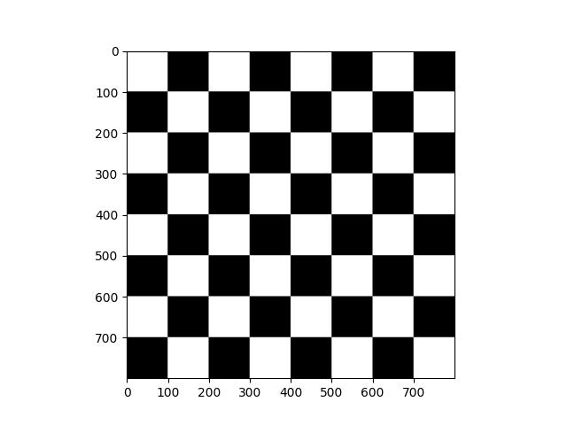
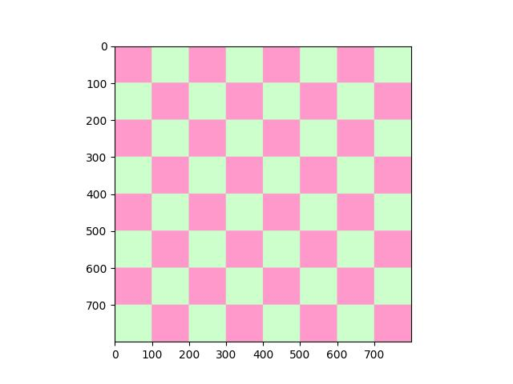
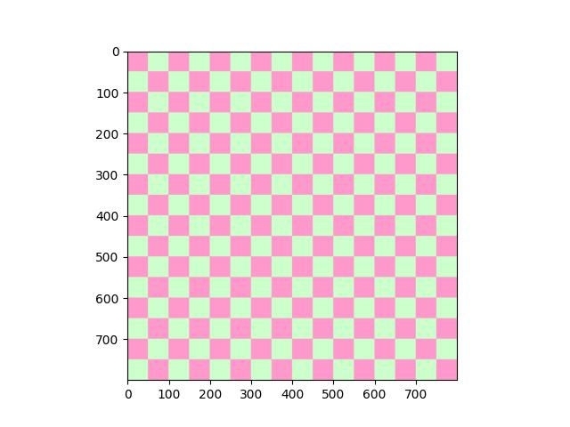

## Selección de solución a entregar en el main:

    - Tarea 1: Tablero ajedrez. Solución: Mix Offset[java] y positions with color changing [Asmii]
    - Tarea 2: Mondrian [Java]
    - Tarea 3: Sol [Java]
    - Tarea 4: 
        - Pixel max min:
            - cv2.maxminloc() [Asmii]
            - numpy [Java]
        - Zona 8x8 max min:
            - cv2.resixe [Asmii]
            - máscara [java]
            - fuerza bruta [Java]
    - Tarea 5:
        - Por terminar [Asmae]
    
Agregar librerías usadas: Jupiter Notebook, opencv, numpy ...

<h1 align="center">Práctica 1</h2>


<h2 align="center">Asignatura: Visión por Computador</h2>

Universidad de Las Palmas de Gran Canaria  
Escuela de Ingeniería en Informática  
Grado de Ingeniería Informática  
Curso 2025/2026 

<h2 align="center">Autores</h2>

- Asmae Ez Zaim Driouch
- Javier Castilla Moreno

<h2 align="center">Librerías Utilizadas</h2>

[](Link_To_Your_NumPy_Page)
[](Link_To_Your_OpenCV_Page)
[](Link_To_Your_Matplotlib_Page)
[](Link_To_Your_Pillow_Page)


<h1 align="center">Tareas</h2>


<h2 align="center">Tarea 1: Tablero de ajedrez</h2>

Se genera tableros de ajedrez utilizando OpenCV y NumPy. El código crea diferentes variaciones de tableros con patrones alternados de colores y diferentes dimensiones. El código produce tres versiones:

- Versión clásica: Blanco y negro tradicional
- Versión colorida: Rosa y verde pastel
- Versión dimensiones aumentada: En este caso 16x16

El recorrido se realiza mediante dos bucles anidados que iteran por filas y columnas. El incremento se hace por el tamaño del cuadrado para posicionarse en cada casilla:

```python
    for row in range(0, height, height//dimension):
    current_offset = int(offset) * square_size

    for column in range(0, width, width//dimension):
        
        if(((row // square_size) + (column // square_size)) & 1 == 0):
            square_color=color1
        else:
            square_color=color2

        cv2.rectangle(color_img, 
                      (row+current_offset,column),
                      (row+current_offset+square_size,column+square_size), 
                      square_color, 
                      -1)
        offset = not offset
```

El patrón de ajedrez se logra usando una operación bitwise que determina si la suma de coordenadas es par o impar:

```python
    if(((row // square_size) + (column // square_size)) & 1 == 0):
            square_color=color1
        else:
            square_color=color2

```

El operador & 1 obtiene el bit menos significativo
Si es 0 → número par → primer color
Si es 1 → número impar → segundo color

Se define el tamaño de cada cuadrado dividiendo las dimensiones totales entre el número de casillas por lado:
```python
    square_size = (width//dimension)
```

El offset corrige la alineación del patrón alternado:

- Se alterna entre True y False en cada fila
- Desplaza horizontalmente cada fila par para mantener el patrón de ajedrez
- Evita que las filas se desalineen creando columnas verticales del mismo color

```python
    current_offset = int(offset) * square_size
    offset = not offset
```

<table align="center">
   <td width="33.33%">
      <h3 align="center">Tablero de ajedrez 8x8</h3>
      <div align="center">
      
   </td>
   <td width="33.33%">
      <h3 align="center">Tablero de ajedrez colorido 8x8</h3>
      <div align="center">                                       
      </a>
   <br> 
   <td width="50%">
      <h3 align="center">Tablero de ajedrez colorido 16x16</h3>
      <div align="center">                                       
      </a>
   <br>                                                 
</table>


<h2 align="center">Tarea 4a: Enconcontrar píxel más claro y oscuro de la imagen</h2>

Para esta tarea se desarrolla dos versiones de un sistema de detección en tiempo real que identifica automáticamente los píxeles más claros y oscuros de una imagen capturada desde la webcam utilizando OpenCV. El programa marca visualmente estos píxeles y muestra sus valores de intensidad.Las versiones desarrolladas son:

- Usando cv2.minMaxLoc()
- Usando las herramientas de numpy

<h3 align="center">Tarea 4a: Usando cv2.minMaxLoc()</h3>

Se utiliza la función nativa de OpenCV para encontrar eficientemente los valores mínimos y máximos en una imagen en escala de grises:

```python
    def find_max_and_min_pixel(frame):
    gray_vid = cv2.cvtColor(frame, cv2.COLOR_BGR2GRAY)
    return cv2.minMaxLoc(gray_vid)
```

Convierte la imagen a escala de grises para análisis de intensidad y retorna una tupla:
- `min_val`: Valor del píxel más oscuro (0-255)
- `max_val`: Valor del píxel más claro (0-255)  
- `min_loc`: Coordenadas (x,y) del píxel más oscuro
- `max_loc`: Coordenadas (x,y) del píxel más claro

📚 **Documentación oficial:** [cv2.minMaxLoc() - OpenCV Documentation](https://docs.opencv.org/4.x/d2/de8/group__core__array.html#ga7622c466c628a75d9ed008b42250a73f)


Bucle Principal de procesamiento:

```python
    while(True):
    ret, frame = vid.read()

    if ret:

        if (mouse_event_flag==0):
            cv2.imshow("Camara", frame)
            cv2.setMouseCallback("Camara", mouse_events)
            mouse_event_flag=1

        min_px, max_px, min_px_coordinates, max_px_coordinates = find_max_and_min_pixel(frame)

        cv2.circle(frame, min_px_coordinates, 10, min_color, 2)
        cv2.circle(frame, max_px_coordinates, 10, max_color, 2)

        # Se usa la función creada para que el texto no salga de la imagen
        put_text_inside(frame, f"Darker: {min_px}", min_px_coordinates, 
                        font=cv2.FONT_HERSHEY_TRIPLEX, scale=0.5, color=min_color, thickness=1)

        put_text_inside(frame, f"Lighter: {max_px}", max_px_coordinates, 
                        font=cv2.FONT_HERSHEY_TRIPLEX, scale=0.5, color=max_color, thickness=1)
        
        cv2.imshow('Camara', frame)
```

Procesa contínuamente los frames del vídeo y al obtener los valores de intensidad los marca con círculo de colores y un texto con su información numérica que siempre permanece visible:
- **Púrpura** `(100,0,100)` → Píxel más oscuro
- **Rosa** `(50,0,200)` → Píxel más claro

**Salida del Programa**:
Pulsando en **ESC** se termina la ejecución y cierra la aplicación

<table align="center">
   <td width="50%">
      <h3 align="center">🎯 Detección en Acción</h3>
      <div align="center">
      <p><strong>Captura en Tiempo Real</strong></p>
      <p>Marcadores automáticos sobre píxeles extremos</p>
   </td>
   <td width="50%">
      <h3 align="center">📊 Análisis de Intensidad</h3>
      <div align="center">
      <p><strong>Valores Numéricos</strong></p>
      <p>Información de intensidad en escala 0-255</p>
   </td>
</table>


<h3 align="center">Tarea 4a: Usando las herramientas de numpy</h3>

Para ambas versiones se ha detectado que usando el cv2.putText(), cuando el pixel más oscuro o más claro se encuentra en los bordes de la imagen, el texto se muestra fuera de la misma. Por ello se ha utilizado herramientas de IA para generar una función que evite que las etiquetas de texto se salgan de los límites de la imagen ajustando automáticamente su posición:

```python
    def put_text_inside(
    img,
    text,
    pos,
    font=cv2.FONT_HERSHEY_SIMPLEX,
    scale=0.6,
    color=(0,0,0),
    thickness=1,
    offset=(10, -10)
):
    """
    Dibuja un texto dentro de los límites de la imagen, con un pequeño offset respecto a la posición dada.
    Parámetros:
        img   : imagen destino
        text  : string a dibujar
        pos   : (x, y) coordenadas del punto de referencia
        offset: (dx, dy) desplazamiento respecto a pos
    """
    h, w = img.shape[:2]
    (text_w, text_h), _ = cv2.getTextSize(text, font, scale, thickness)

    # Aplicar offset
    x = pos[0] + offset[0]
    y = pos[1] + offset[1]

    # Ajustar coordenadas si el texto se sale
    if x < 0:
        x = 0
    if x + text_w > w:
        x = w - text_w
    if y - text_h < 0:
        y = text_h
    if y > h - 1:
        y = h - 1

    cv2.putText(img, text, (x, y), font, scale, color, thickness, cv2.LINE_AA)
```


<h2 align="center">Tarea 4b: Enconcontrar la zona 8x8 más clara/oscuran</h2>

Para esta tarea se desarrolla tres versiones de un sistema de detección en tiempo real que identifica regiones completas según las dimensiones propuestas (en un inicio 8x8) más claros y oscuros de una imagen capturada desde la webcam utilizando OpenCV.Las versiones desarrolladas son:

- Usando cv2.resize()
- Usando máscaras
- Usando Fuerza bruta

Nuevamente, en las tres versiones se hace usao de la función anterior en donde evita que las etiquetas de texto se salgan de los límites de la imagen ajustando automáticamente su posición: **put_text_inside(img, text, pos, font=cv2.FONT_HERSHEY_SIMPLEX, scale=0.6, color=(0,0,0), thickness=1, offset=(10, -10))**

<h3 align="center">Tarea 4b:  Usando cv2.resize()</h3>

El algoritmo divide la imagen en una grilla de bloques de 8x8 píxeles y encuentra las regiones con mayor y menor intensidad promedio. 

Esto se logra debido a que la función resize de openCV divide mentalmente la imagen en una cuadrícula de bloques 8x8 y calcula el promedio de intensidad de cada bloque usando interpolación bilineal.


📚 **Documentación técnica:** [Resizing and Rescaling Images with OpenCV](https://opencv.org/blog/resizing-and-rescaling-images-with-opencv/)

Logrando con ello reducir el costo computacional.

```python
    def find_max_and_min_pixel_8x8(frame):
    gray_vid = cv2.cvtColor(frame, cv2.COLOR_BGR2GRAY)
    height, width = gray_vid.shape
    vid_block = cv2.resize(gray_vid, (width//block_size, height//block_size))
    return cv2.minMaxLoc(vid_block)
```

Una imagen de 640x480 se convierte en 80x60. Con `cv2.resize()` se calcula automáticamente el valor promedio de cada bloque 8x8 y se obtiene los valores resultantes representan fielmente la intensidad promedio de cada región.

Como trabajamos con una imagen reducida, debemos escalar las coordenadas de vuelta a la resolución original:

```python
   # Escalar coordinadas de vuelta
        min_block_coordinates_scale = ((min_block_coordinates[0]*block_size+(block_size//2)),
                                       (min_block_coordinates[1]*block_size+(block_size//2)))
        max_block_coordinates_scale = ((max_block_coordinates[0]*block_size+(block_size//2)),
                                       (max_block_coordinates[1]*block_size+(block_size//2)))

```
1. **Multiplicar por `block_size`**: Convierte coordenadas de bloque a píxeles
2. **Sumar `block_size//2`**: Centra el marcador en el medio del bloque
3. **Resultado**: Coordenada del centro del bloque 8x8 en la imagen original

Finalmente se emplea marcadores circulares para representar visualmente el área.

<table align="center">
   <td width="50%">
      <h3 align="center">🔍 Análisis Píxel Individual</h3>
      <div align="center">
      <p><strong>Tarea 4a - Precisión Máxima</strong></p>
      <p>Detección de píxeles extremos puntuales</p>
   </td>
   <td width="50%">
      <h3 align="center">🎯 Análisis por Bloques</h3>
      <div align="center">
      <p><strong>Tarea 4b - Eficiencia Optimizada</strong></p>
      <p>Identificación de regiones 8x8 representativas</p>
   </td>
</table>

<h3 align="center">Tarea 4b:  Usando máscaras</h3>

<h3 align="center">Tarea 4b:  Usando Fuerza bruta</h3>


<h2 align="center">Tarea 5: Pop art</h2>

Se desarrolla un generador de arte pop digital inspirado en los estilos de **Roy Lichtenstein y Andy Warhol**. El sistema transforma fotografías convencionales en composiciones artísticas mediante manipulación del espacio de color HSV y la adición de malla de círculos para acercarnos más a las característicos del cómic.

La conversión a espacio de color HSV:

- **H (Hue):** Tono/matiz del color
- **S (Saturation)**: Saturación/intensidad
- **V (Value)**: Brillo/luminosidad

Se inicia convirtiendo la imagen de RGB a HSV para su manipulación:

```python
    # Convertir a HSV
    hsv = cv2.cvtColor(pop_art_rgb, cv2.COLOR_BGR2HSV)
```

A continuación se crea la función de desplazamiento de matiz con la que se crea variaciones cromáticas rotando el canal Hue de la imagen:

```python
    def shift_hue(hsv_img, shift):
    hsv_copy = hsv_img.copy()
    hsv_copy[:, :, 0] = (hsv_copy[:, :, 0].astype(int) + shift) % 180
    return hsv_copy
```

En OpenCV, el canal Hue va de 0-179 (180 valores). El operador % 180 crea un ciclo cromático: 179+1 = 0 permite rotación completa del espectro de colores sin valores fuera de rango.

Se crean 9 variaciones con diferentes desplazamientos de matiz inspirados en el estilo de Warhol:

```python
    variaciones = [0, 30, 60, 90, 10, 100, 15, 150, 45]

    imgs = [cv2.cvtColor(shift_hue(hsv, shift), cv2.COLOR_HSV2RGB) 
        for shift in variaciones]
```
0°: Imagen original (referencia)
30°, 60°, 90°: Rotaciones primarias del espectro
10°, 15°, 45°: Variaciones sutiles para transiciones suaves
100°, 150°: Contrastes dramáticos estilo Warho

Para la salida de las imágenes se emplea:

```python
    # Cuadrícula 3x3 característica del arte pop
    fig, axs = plt.subplots(3, 3, figsize=(8, 8))
    for ax, im in zip(axs.ravel(), imgs):
        ax.imshow(im)
        ax.axis("off")  # Sin ejes para efecto galería
````


<table align="center">
   <td width="33.33%">
      <h3 align="center">Imagen Original</h3>
      <div align="center">
      
   </td>
   <td width="33.33%">
      <h3 align="center">Pop Art aplicado</h3>
      <div align="center">                                       
      </a>
   <br> 
   <td width="50%">
      <h3 align="center">Pop art y efecto comic(malla circulos)</h3>
      <div align="center">                                       
      </a>
   <br>                                                 
</table>