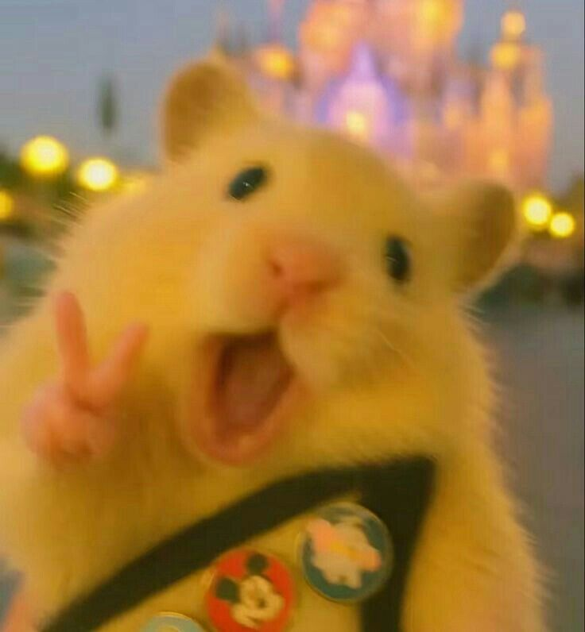
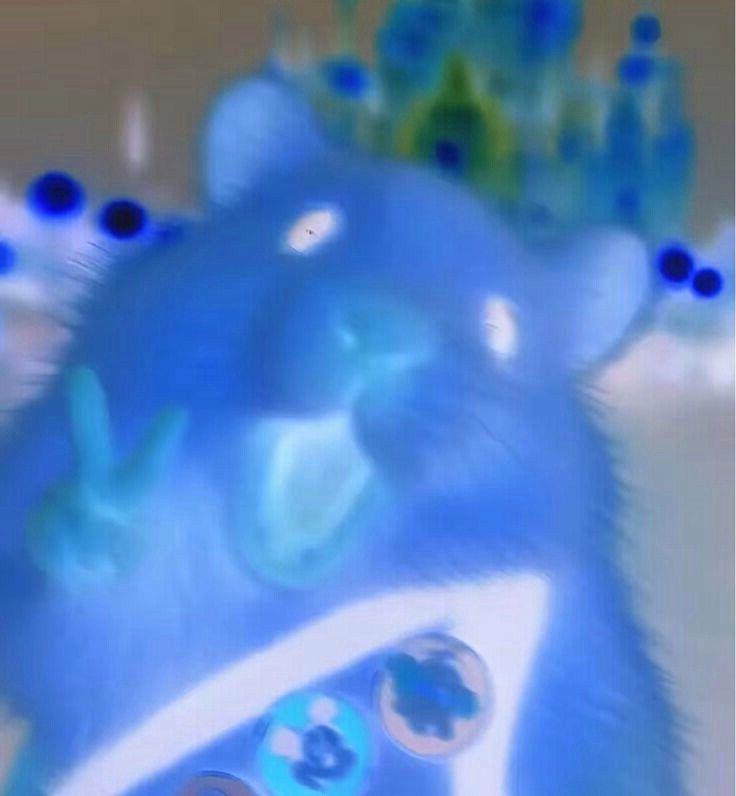
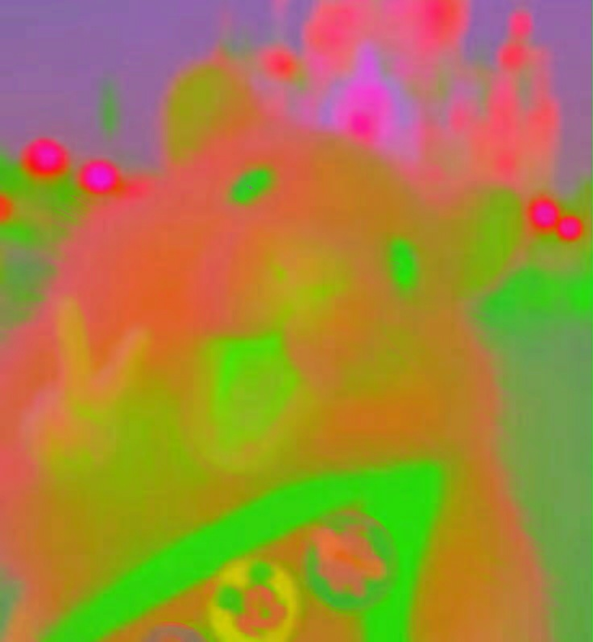
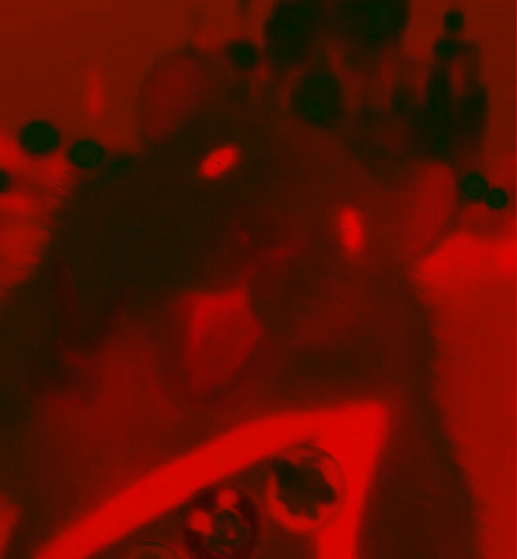
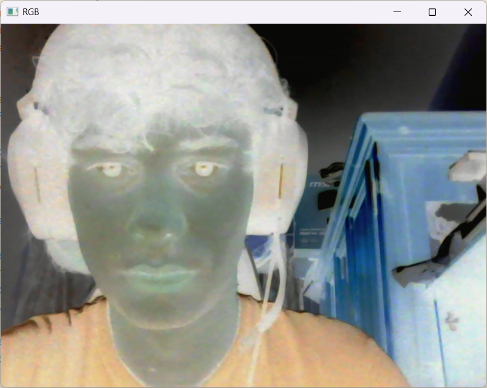
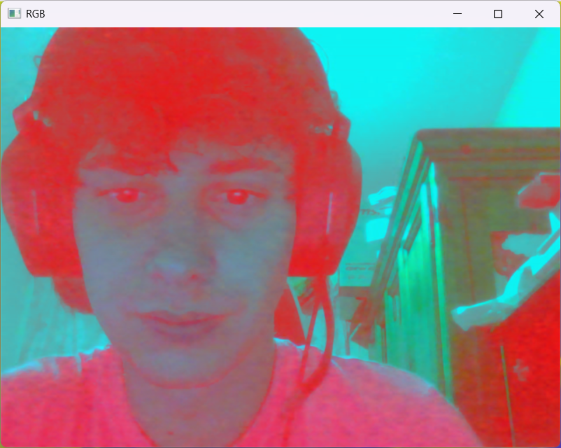
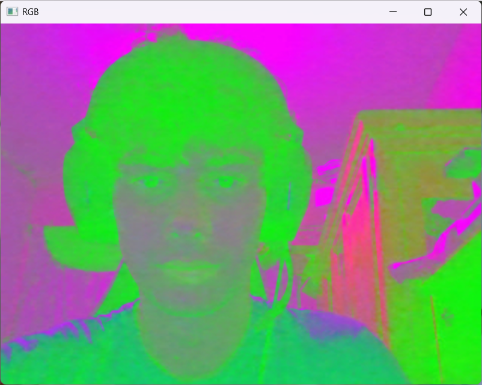
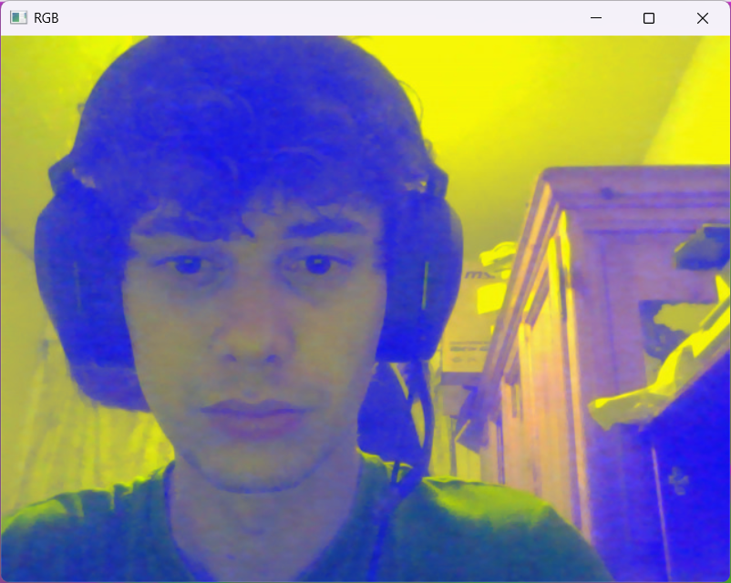

# Práctica 1 - Visión por Computador (2025 - 2026)
# Autores
- Asmae Ez Zaim Driouch
- Javier Castilla Moreno
# Bibliotecas utilizadas
- Numpy
- OpenCV
- MatplotLib
# Cómo usar
## Primer paso: clonar este repositorio
```bash
    git clone "https://github.com/Javier-Castilla/VC-P1"
```
## Segundo paso: Activar tu envinroment e instalar dependencias
> [!NOTE]
> Todas las dependencias pueden verse en [este archivo]().
# Tarea 2: Imagen al estilo Mondrian
Se ha generado una imagen al estilo Mondrian haciendo uso de las utilidades que presenta la biblioteca OpenCV.

Concretamente, se ha tomado como referencia la siguiente imagen:


La manera de proceder ha sido sencilla, se han guardado en una lista de python las distintas coordenadas necesarias para dibujar los distintos rectángulos que conforman la imagen. Junto a las coordenadas, se establece el color que tendrá cada rectángulo.

Una vez guardadas las diferentes coordenadas y colores, se recorre la lista y se dibuja sobre una imagen generada inicialmente en blanco cada rectángulo de la siguiente manera:

```python`
for i, rectangle in enumerate(rectangles):
    cv2.rectangle(img, rectangle[0], rectangle[1], rectangle[2], -1)
    cv2.rectangle(img, rectangle[0], rectangle[1], (0, 0, 0), 5)
``

Posteriormente, se muestra la imagen y se guarda en disco de la siguiente manera:

```python
plt.imshow(img)
plt.show()
cv2.imwrite('imgs/mondrian.jpg', cv2.cvtColor(img, cv2.COLOR_RGB2BGR))
```

> [!NOTE]
> Destacar que es necesario pasar la imagen a BGR antes de guardarla en disco haciendo uso de OpenCV para una correcta visualización posterior.

La imagen resultante es la siguiente:


# Tarea 3: editar los diferentes planos de una imagen
Para esta tarea, se han editado los diferentes planos tanto de una imagen guardada en disco como los fotogramas de un vídeo en vivo tomados desde la webcam del ordenador.
Con el fin de que dichas modificaciones sean reutilizables y aplicables a diferentes imágenes o fotogramas, se ha realizado una clase para esta tarea, permitiendo aplicar filtros y máscaras de una manera sencilla y cómoda (`Tarea3`).

En la clase anterior se observa como existen métodos estáticos que permiten invertir los diferentes colores de una imagen (R, G, B) así como el negativo de la misma o en su defecto, modificar individualmente y de manera personalizada los diferentes canales. En resumen, permite las siguientes operaciones:
- Imagen en negativo
- Invertir un canal específico
- Modificar canales de manera personalizada
## Modificación de los diferentes canales de una imagen leída de disco
Para lograr esto, se ha seleccionado una imagen y se ha cargado en memoria desde el disco con el siguiente código:

```python
image = cv2.imread('imgs/happy_hamster.jpg', cv2.IMREAD_COLOR_RGB)
plt.imshow(image)
plt.show()
```

Mostrándose la siguiente imagen:



A continuación, se han invertido los colores de la imagen haciendo uso de la clase `Tarea3` mostrada anteriormente. A continuación el código de dicho método:

```python
@staticmethod
def negative_image(image):
    return 255 - image
```

Simplemente, se resta al valor máximo (255) el valor de cada píxel de la imagen, obteniendo así su complementario. El resultado se muestra con el siguiente código:

```python
plt.imshow(img := Tarea3.apply_transformation(image, Tarea3.NEGATIVE))
plt.show()
cv2.imwrite("imgs/happy_hamster_negative.jpg", cv2.cvtColor(img, cv2.COLOR_RGB2BGR))
```

Y ésta es la imagen resultante:



Aplicando ésta misma estrategia, se ha invertido el canal verde (G) de la imagen original, resultando en el siguiente código:

```python
plt.imshow(img := Tarea3.apply_transformation(image, Tarea3.INVERT_GREEN))
plt.show()
cv2.imwrite("imgs/happy_hamster_green_negative.jpg", cv2.cvtColor(img, cv2.COLOR_RGB2BGR))
```

Resultando en la siguiente imagen:



El método utilizado para ello ha sido el siguiente:

```python
@staticmethod
def invert_green(image):
    image = image.copy()
    image[:,:,1] = 255 - image[:,:,1]
    return image
```

En él, se observa como se aplica la misma estrategia inicial, pues se le resta al mñaximo valor (255) el valor de cada píxel en el canal verde (G).

> [!NOTE]
> Para invertir el resto de colores se aplica la misma estrategia en el canal deseado.

Finalmente, se ha editado de manera aleatoria la imagen original, invirtiendo el canal rojo (R), estableciendo al 12% de su valor original el canal verde (G) y omitiendo completamente el canal azul (B). Para ello se ha hecho uso del siguiente código:

```python
plt.imshow(img := Tarea3.change_color_percentage(image, -1, 0.12, 0))
plt.show()
cv2.imwrite("imgs/happy_hamster_random.jpg", cv2.cvtColor(img, cv2.COLOR_RGB2BGR))
```

Resultando en la siguiente imagen:



Para lograr esto, se ha hecho uso del siguiente método:

```python
@staticmethod
def change_color_percentage(image, r=1, g=1, b=1):
    image = image.copy()
    image[:,:,0] = (image[:,:,0] * r) if r != -1 else 255 - image[:,:,0]
    image[:,:,1] = (image[:,:,1] * g) if g != -1 else 255 - image[:,:,1]
    image[:,:,2] = (image[:,:,2] * b)if b != -1 else 255 - image[:,:,2]
    return image
```

Como se puede observar, se pasan por parámetros tanto la imagen como el porcentaje del valor que tendrá cada canal en la nueva imagen, siendo -1 la inversión de dicho canal.

## Modificación de los diferentes canales de los fotogramas de un vídeo en vivo tomado desde la webcam
Para lograr obtener un vídeo en vivo a través de la webcam, se ha usado la biblioteca OpenCV, concretamente el siguiente método:

```python
video = cv2.VideoCapture(0)
```

Ésto, con la ayuda de un bucle infinito, permite leer los diferentes fotogramas del vídeo en tiempo real tomado por la webcam.

En este caso, se han añadido controler para cambiar entre la inversión total de canales de los fotogramas o en consecuencia, la inversión de un canal concreto. Los controles son los siguientes:
- `1` --> Negativo
- `2` --> Verde invertido
- `3` --> Azul invertido
- `4` --> Rojo invertido

Al elegir la máscara que queramos aplicar a la imagen, se mostrará en tiempo real, permitiéndo ver el vídeo tomado por la webcam de maneras singulares.

A continuación, se muestra una tabla con las cuatro modificaciones posibles:

<table align"center>
    <td width="25%">
        
    </td>
    <td width="25%">
        
    </td>
    <td width="25%">
        
    </td>
    <td width="25%">
        
    </td>
</table>